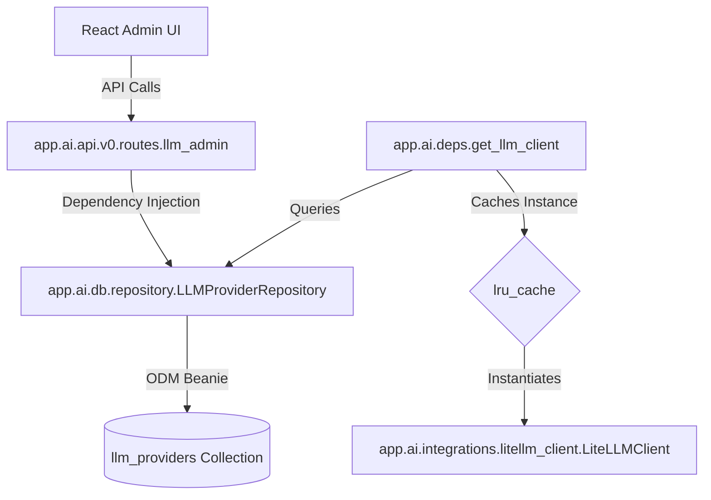

# LLM Providers Configuration & Routing Feature

The LLM Providers configuration system provides a secure, decoupled, and database-driven approach to configure, prioritize, and monitor the language model API backends. Under the hood, it uses **LiteLLM Router** to implement multi-provider failover, rate-limit cooldowns, and latency-based routing.

---

## 🏛️ Architecture & Component Design

The LLM Providers feature is located in the `backend/app/ai/` module and follows a standard clean layered architecture:

### 1. Database Schema (`LLMProvider` Beanie Document)
Configurations are stored in MongoDB via the [LLMProvider](file:///home/ali/Projects/Own-Projects/my-inner-pages-root/my-inner-pages/backend/app/ai/db/models.py) model:
* `model_name`: Router alias used internally (default: `"default"`).
* `litellm_params`: LiteLLM-specific configuration parameters (`model`, `api_base`, `api_key`, `rpm`, `tpm`, etc.).
* `order`: Integer priority indexing. The router tries providers in ascending priority order.
* `is_active`: Boolean flag allowing administrators to temporarily disable a provider.

### 2. Repository Layer (`LLMProviderRepository`)
The [LLMProviderRepository](file:///home/ali/Projects/Own-Projects/my-inner-pages-root/my-inner-pages/backend/app/ai/db/repository.py) class abstracts all database operations:
* `get_active_providers()`: Queries active sorted providers.
* `get_all_providers()`: Queries all configured providers sorted by priority.
* `replace_providers()`: Replaces the configurations list atomically (delete all + insert new).

---

## ⚡ Cache & Performance Management

To prevent blocking database reads on every message reflection or chat request, the LLM client uses a standard **Python LRU Cache** wrapper inside [deps.py](file:///home/ali/Projects/Own-Projects/my-inner-pages-root/my-inner-pages/backend/app/ai/deps.py):

1. **Async Fetching & Hashing:**
   When [get_llm_client()](file:///home/ali/Projects/Own-Projects/my-inner-pages-root/my-inner-pages/backend/app/ai/deps.py#L41) is called, it queries the database repository asynchronously for active providers and converts their configurations to a sorted JSON tuple.
2. **Standard Caching Factory:**
   The hashable tuple is passed to `get_cached_litellm_client(model_list_tuple, ...)`, which is decorated with `@lru_cache(maxsize=1)`.
3. **Zero-Downtime Hot-Swaps:**
   If configuration parameters change or a model is toggled, the serialized JSON representation changes, automatically causing the `@lru_cache` to clear and re-instantiate the client router on the very next request.
4. **Graceful Fallback:**
   If the database contains no active providers, the dependency automatically returns the `MockLLMClient` and emits a warning, preventing application startup or runtime crashes.

---

## 🔒 Security & Key Obfuscation

Actual API keys should **never** be stored in the database or exposed to the client.

### Environment Variable Placeholders
API keys are configured using shell-style environment variables references, e.g. `"api_key": "${OPENROUTER_API_KEY}"`. 
* At runtime, [LiteLLMClient](file:///home/ali/Projects/Own-Projects/my-inner-pages-root/my-inner-pages/backend/app/ai/integrations/litellm_client.py) resolves these placeholders from the server environment before building the router.
* Only the placeholder string `"${ENV_VAR}"` is stored in the database, keeping it safe.

### REST Obfuscation & Preservation Logic
Inside [llm_admin.py](file:///home/ali/Projects/Own-Projects/my-inner-pages-root/my-inner-pages/backend/app/ai/api/v0/routes/llm_admin.py):
* **GET `/providers`:** Masking logic hides resolved API keys, returning only the first 6 characters and last 4 characters, e.g., `"${OPENROUTER_API_KEY} (sk-proj...1f3d)"` or `"sk-or-...1f3d"` if entered directly.
* **PUT `/providers`:** The controller detects incoming obfuscated values. If the key submitted matches an obfuscated format (contains `...` or `*`), it preserves the original key value from the database, preventing key corruption during forms saves.

---

## 🛠️ Operations & Diagnostics

### Live Diagnostic Tests
Administrators can run parallel diagnostics on configured models:
* **REST endpoint:** `POST /api/v0/admin/llm/test`
* **CLI script:** `backend/scripts/diagnose_providers.py`

The diagnostic script connects to MongoDB, retrieves the configured models, resolves environment placeholders, and fires concurrent probes to each provider directly. It measures latency and records error responses (e.g. rate limits or bad keys) in a detailed console output table.
